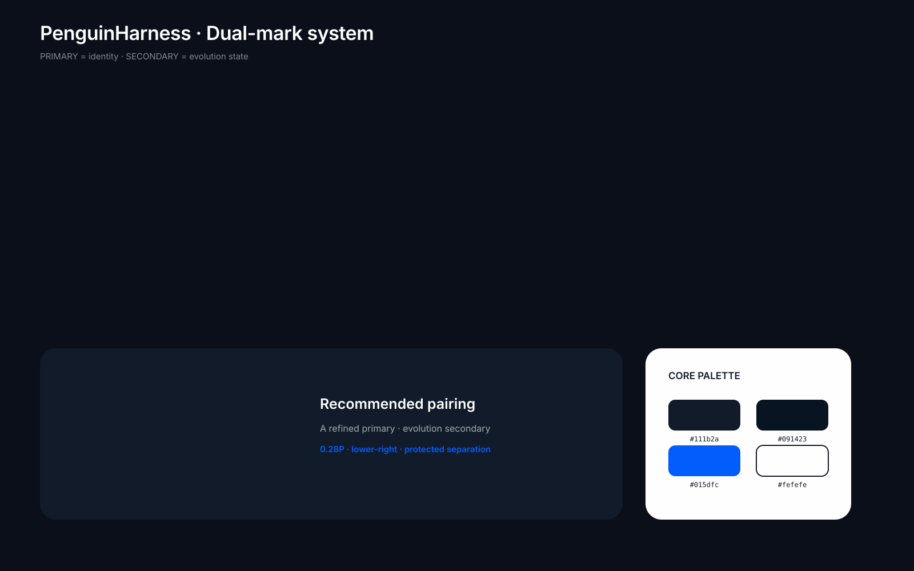
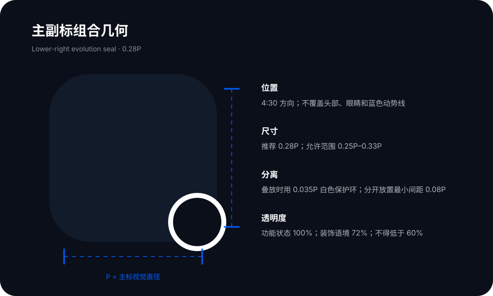
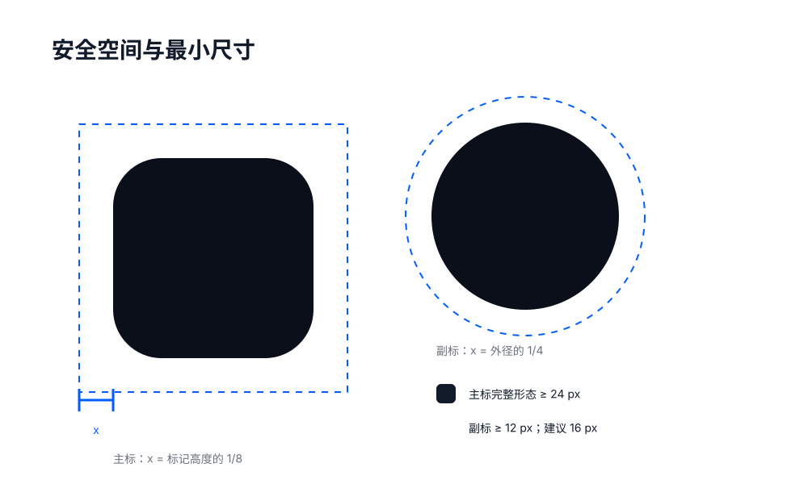

# PenguinHarness Logo 与双标记组合规范

版本：1.0  
日期：2026-08-04

## 推荐结论

App icon 首选 **版本 A · 精炼强化版**。它保留了原企鹅的头身比例、前冲姿态、上扬鳍翼与蓝色动势线，变化集中在轮廓净化和节奏收敛，因而品牌迁移成本最低。相较 B，A 在 32–128 px 下没有轨道线穿越头部的视觉竞争；相较 C，A 在 Dock 的缩放、阴影和邻近图标干扰下更稳定。C 最适合作为 Splash、About 与品牌动效中的“自进化叙事版”，D 则专用于 16 px 级微尺寸。

双标记系统的默认组合是：**A 主标 + 自进化副标**。主标负责“这是 PenguinHarness”，副标负责“当前涉及版本、进化、加载或状态”。

## 1. Logo 版本

| 版本 | 设计变化 | 适用场景 | 文件 |
|---|---|---|---|
| A · 精炼强化 | 两段深藏青渐变；两条克制动势线；完整辨识度 | App icon、侧栏品牌区、默认品牌展示 | [白底 SVG](logos/penguinharness-a-white.svg) · [深底 SVG](logos/penguinharness-a-dark.svg) |
| B · 几何化 | 明确切线；两条几何轨道；工程构造感最强 | 技术活动、工程文档封面、大尺寸视觉 | [白底 SVG](logos/penguinharness-b-white.svg) · [深底 SVG](logos/penguinharness-b-dark.svg) |
| C · 层叠 | 主体前置；两层递减版本残影；蓝线连接继承 | Splash、About、进化功能入口 | [白底 SVG](logos/penguinharness-c-white.svg) · [深底 SVG](logos/penguinharness-c-dark.svg) |
| D · 单色 | 去除眼睛、腹部、渐变与细线，仅保留核心外轮廓 | 16 px 微图标、状态点、极限印刷 | [深藏青 SVG](logos/penguinharness-d-navy.svg) · [电光蓝 SVG](logos/penguinharness-d-blue.svg) |

所有生产 SVG 使用 1024×1024 `viewBox`。A/B/C 的圆角白色画板采用 944 px 边长和 226 px 圆角，视觉圆角约 24%。深底文件中的 `#0a0f1a` 仅作为呈现环境，Logo 本体仍只使用 `#111b2a / #091423 / #015dfc / #fefefe`。

## 2. 场景分工

| 场景 | 标记 | 推荐尺寸 | 使用规则 | 示例 |
|---|---|---:|---|---|
| App icon（macOS Dock） | 主标 A | 1024×1024 源文件 | 保留白色圆角方板，不叠加副标 | [SVG](scenes/01-app-icon.svg) |
| 窗口内品牌区（侧栏顶部） | 主标 + Wordmark | 主标 24–28 px | 主标在前，文字在后，垂直居中 | [SVG](scenes/02-sidebar-brand.svg) |
| Favicon | 副标 | 16 / 32 px | 默认用副标；需要强化产品身份时才用 D | [SVG](scenes/03-favicon.svg) |
| Loading spinner | 副标 | 48 px | 整体顺时针匀速旋转；不改变单条弧的相对关系 | [SVG](scenes/04-loading.svg) |
| 进化状态指示器 | 副标 | 12–16 px | 与版本号或分数组合，不单独表达成功/失败 | [SVG](scenes/05-evolution-status.svg) |
| 文档水印 | 副标单色 | 80 px | 透明度 8–12%；距页面边缘至少 0.5 倍标记外径 | [SVG](scenes/06-watermark.svg) |
| Splash | 主标 + 副标 | 主标 144–192 px | 副标位于右下 4:30 方向，作为“进化印章” | [SVG](scenes/07-splash.svg) |
| About | 主标 + 副标 + Wordmark | 主标 120 px；副标 32 px | 展示完整系统，可附一行产品描述 | [SVG](scenes/08-about.svg) |

> 任务 1 中的 D 与任务 2 中的 Favicon 分工并不冲突：默认品牌 Favicon 用“自进化副标”，D 是在 16 px 仍需保留企鹅身份时的备用微标。

## 3. 主副标组合几何

- **位置：**副标位于主标右下方 4:30 方向，不遮挡企鹅头部、眼睛、腹部负形或蓝色动势线。
- **尺寸：**副标外径推荐为主标视觉直径 `P` 的 `0.28P`；允许范围 `0.25P–0.33P`。不要放大到与主标同级。
- **叠放：**副标作为角标叠放时，使用 `0.035P` 的白色保护环；不得把副标直接压在企鹅身体上。
- **分开放置：**副标与主标的最小净间距为 `0.08P`。
- **透明度：**功能性状态保持 100%；辅助装饰可降到 72%；需要可识别时不得低于 60%。水印是唯一例外。

## 4. 安全空间与最小尺寸

- **主标安全空间：**外部元素与画板之间至少保留主标高度的 `1/8`。画板内部留白已经固化，不要单独放大企鹅。
- **主标最小尺寸：**完整 A/B/C 不小于 24 px；若需要保留蓝色动势线，建议至少 32 px。低于 24 px 改用 D 或副标。
- **副标安全空间：**以副标外径的 `1/4` 为最小安全空间。
- **副标最小尺寸：**技术下限 12 px，推荐下限 16 px。12 px 时使用 100% 不透明度。
- **D 最小尺寸：**16 px。不要在 D 内恢复眼睛或腹部细节。

## 5. Wordmark 字体

- **拉丁字体：**首选 Inter；macOS 原生界面可用 SF Pro；无法加载时使用系统无衬线字体。
- **中文伴随文本：**思源黑体 / Noto Sans CJK SC，使用 Medium。
- **字重：**默认 Semibold 600；密集侧栏可用 Medium 500。不要使用 Bold 700 以上。
- **尺寸关系：**大写高度/主要字面高度约为主标高度的 50–60%。24 px 主标搭配 14–16 px Wordmark；28 px 主标搭配 16–17 px。
- **字间距：**`-0.01em`；大于 24 px 的展示字号可收紧到 `-0.02em`。
- **组合间距：**图标到 Wordmark 的水平间距为主标高度的 `0.35–0.45` 倍。
- **书写：**固定使用 `PenguinHarness`，不拆词、不改大小写、不在 Logo 内加入标语。

## 6. 配色

| Token | 色值 | 用途 |
|---|---|---|
| Navy 01 | `#111b2a` | 主体渐变起点、单色深标 |
| Navy 02 | `#091423` | 主体渐变终点、深色细节 |
| Electric Blue | `#015dfc` | 动势线、副标、状态强调 |
| White | `#fefefe` | 画板、腹部负形、深色界面文字 |
| Presentation Dark | `#0a0f1a` | 深底展示环境；不是 Logo 本体颜色 |

渐变仅允许 `#111b2a → #091423` 两个色站。禁止光晕、投影、彩虹和额外中间色。

## 7. 禁止用法

- 不旋转、挤压或改变企鹅头身比例。
- 不让轨道或副标穿过企鹅的眼睛、头部或腹部负形。
- 不移除 A/B/C 的白色画板后直接放在复杂图片上。
- 不把主标和副标做成相同尺寸。
- 不用副标代替所有品牌识别；没有上下文的首次曝光应出现主标或 Wordmark。
- 不添加对话气泡、齿轮、电路板、霓虹、文字或装饰性小图标。

## 8. GPT Image 2 概念母版

GPT Image 2 用于探索四个方向，随后以生产 SVG 收口颜色和几何。原始概念 PNG 保存在 [`concepts/`](concepts/)：

- [A · refined](concepts/gpt-image2-a-refined.png)
- [B · geometric](concepts/gpt-image2-b-geometric.png)
- [C · layered](concepts/gpt-image2-c-layered.png)
- [D · mono blue](concepts/gpt-image2-d-mono-blue.png)

完整生成提示词见 [GPT-IMAGE2-PROMPTS.md](GPT-IMAGE2-PROMPTS.md)。

生产文件以本规范中的 SVG 为准。
