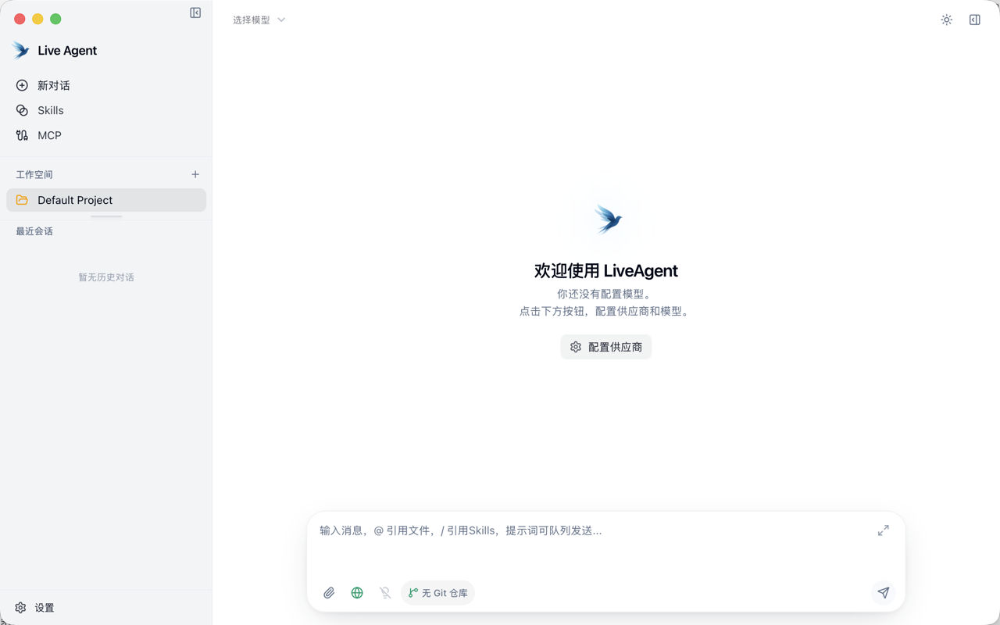
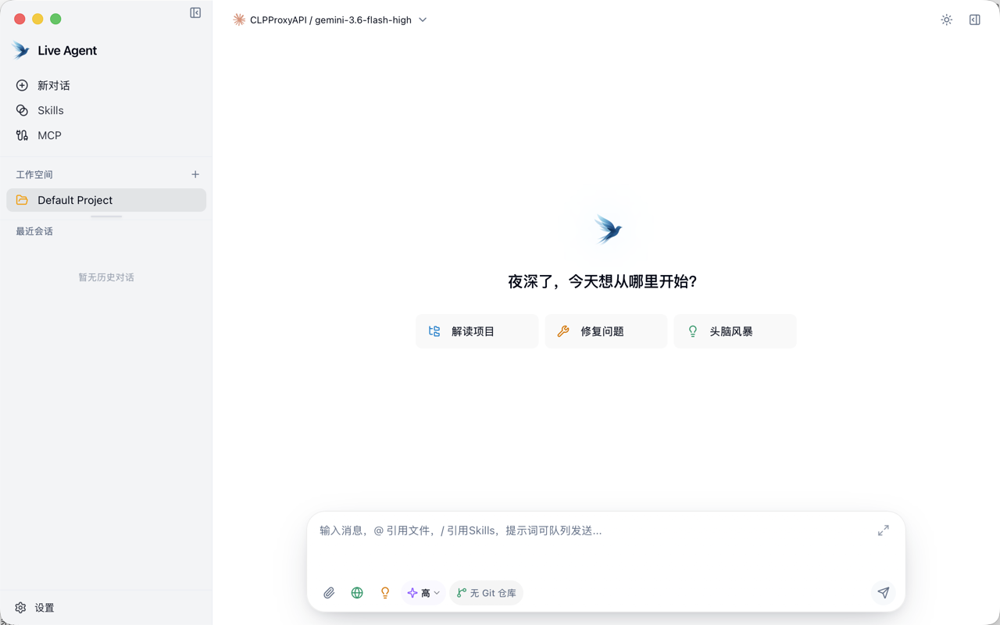
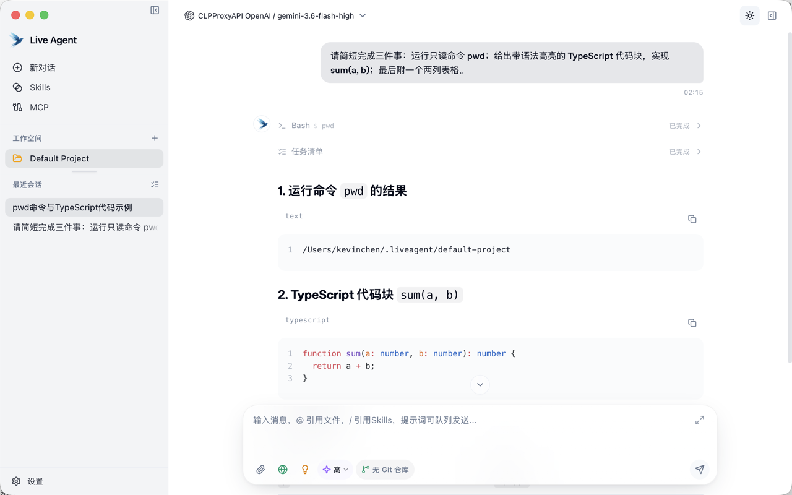
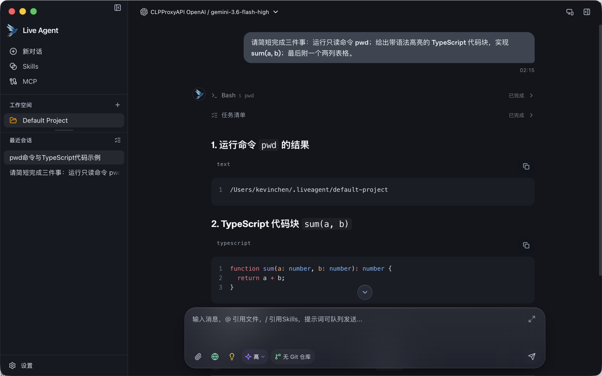
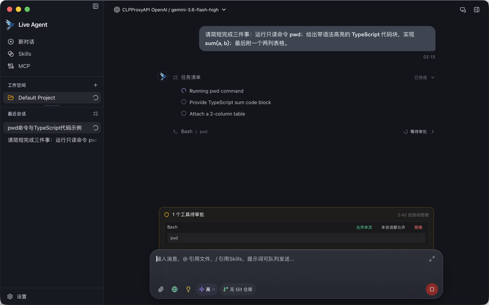
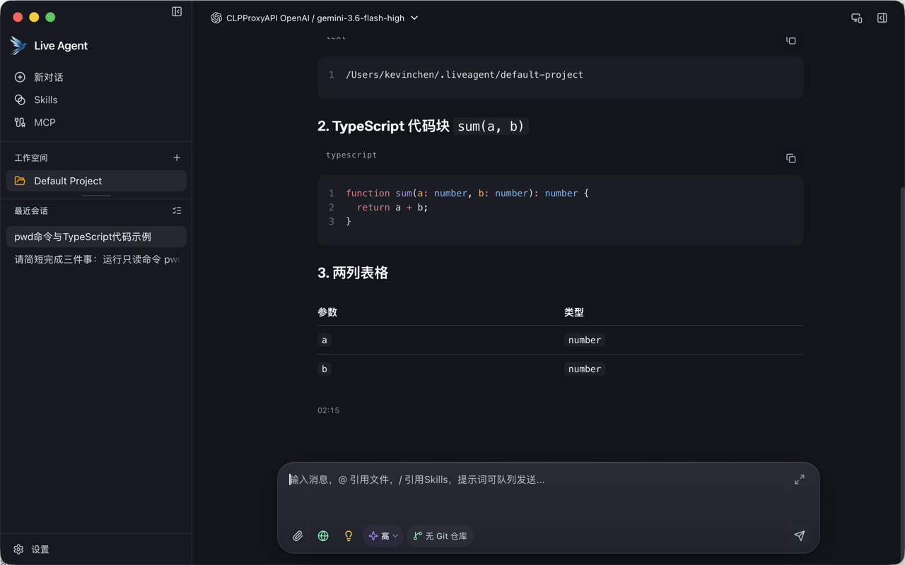
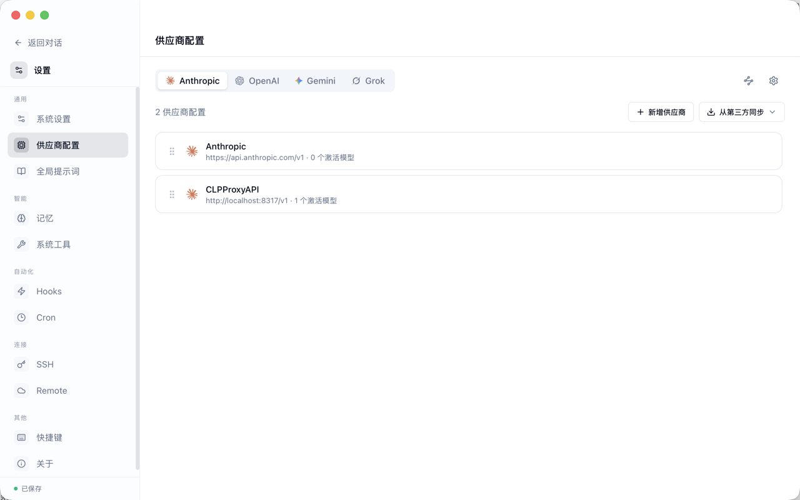

# LiveAgent 视觉记忆

> 观察对象：`/Users/kevinchen/LiveAgent/crates/agent-gui/`  
> 源码版本：`7de95a20`  
> 运行时观察：macOS，窗口统一为 1280 × 800，2026-08-04  
> 数据口径：颜色与动效来自源码；尺寸以 1280 × 800 运行时截图量取，并用组件类名交叉核实。截图均为真实 Tauri WebView 渲染，不是 mock。

## §1 整体气质

LiveAgent 是一套“扁平骨架 + 局部玻璃焦点”的高密度桌面界面：大面积画布几乎不做装饰，层级主要依靠 1px 低对比边框、轻微明度差与非常克制的阴影建立。它不像 ChatGPT / Claude 桌面版那样把对话本身做成品牌化、留白宽松的阅读场，而更接近工程工具——模型、Workspace、工具调用、任务清单和审批状态始终离用户很近。真正具有识别度的部分不是全局玻璃化，而是 Composer、浮层、Hub 卡片等“当前操作焦点”才获得 blur、saturate、白色 rim-light 与多层投影。整体冷静、实用、信息密度高，但视觉主次有时只差半级灰度；PenguinHarness 可保留这种克制，并借鉴 Codex 桌面端更清晰的任务层级与工作区叙事，将“聊天助手”提升为“Agent 构建工作台”。



## §2 设计 Token

### 2.1 配色

以下变量逐项核对自 `src/index.css`。值保持源码的 HSL 三元组写法；使用时为 `hsl(var(--token))`。

#### 浅色板 `:root`

```css
--background: 0 0% 100%;
--foreground: 222.2 84% 4.9%;
--card: 0 0% 100%;
--card-foreground: 222.2 84% 4.9%;
--popover: 0 0% 100%;
--popover-foreground: 222.2 84% 4.9%;
--primary: 222.2 47.4% 11.2%;
--primary-foreground: 210 40% 98%;
--secondary: 210 40% 96.1%;
--secondary-foreground: 222.2 47.4% 11.2%;
--muted: 210 40% 96.1%;
--muted-foreground: 215.4 16.3% 46.9%;
--accent: 210 40% 96.1%;
--accent-foreground: 222.2 47.4% 11.2%;
--destructive: 0 84.2% 60.2%;
--destructive-foreground: 210 40% 98%;
--border: 214.3 31.8% 91.4%;
--input: 214.3 31.8% 91.4%;
--ring: 222.2 84% 4.9%;
--sidebar-bg: 220 14% 96%;
--hub-canvas: var(--background);
--chip-bg: 220 13% 91%;
--chip-bg-hover: 220 13% 86%;
--send-disabled-bg: 220 13% 91%;

--chat-user-bg: 220 9% 91%;
--chat-user-fg: 222 84% 5%;
--chat-assistant-bg: 0 0% 100%;
--chat-assistant-fg: 222.2 84% 4.9%;
--chat-tool-bg: 0 0% 100%;
--chat-tool-border: 220 13% 91%;
--chat-thinking-bg: 220 14% 97%;
--chat-thinking-border: 220 13% 90%;
--chat-success: 152 60% 42%;
--chat-error: 0 72% 51%;
--chat-running: 252 56% 57%;

--tool-card-bg: 0 0% 100% / 0.72;
--tool-card-border: 0 0% 0% / 0.06;
--tool-bash-accent: 142 70% 45%;
--tool-file-accent: 220 70% 55%;
--tool-search-accent: 38 92% 50%;
--tool-list-accent: 262 52% 56%;

--checkpoint-accent: 220 9% 46%;
--checkpoint-bg: 0 0% 100% / 0.72;
--checkpoint-border: 0 0% 0% / 0.06;
--checkpoint-icon-bg: 220 10% 95%;
--checkpoint-icon-fg: 220 9% 46%;
```

#### 深色板 `.dark`

```css
--background: 224 22% 9%;
--foreground: 210 30% 96%;
--card: 224 22% 10%;
--card-foreground: 210 30% 96%;
--popover: 224 20% 12%;
--popover-foreground: 210 30% 96%;
--primary: 210 30% 96%;
--primary-foreground: 222.2 47.4% 11.2%;
--secondary: 220 18% 17%;
--secondary-foreground: 210 30% 96%;
--muted: 220 18% 17%;
--muted-foreground: 215 18% 76%;
--accent: 220 18% 17%;
--accent-foreground: 210 30% 96%;
--destructive: 0 62.8% 36%;
--destructive-foreground: 210 30% 96%;
--border: 220 14% 26%;
--input: 220 14% 26%;
--ring: 212.7 26.8% 83.9%;
--sidebar-bg: 224 22% 11%;
--hub-canvas: 224 24% 6.5%;
--chip-bg: 220 16% 24%;
--chip-bg-hover: 220 16% 30%;
--send-disabled-bg: 220 16% 24%;

--chat-user-bg: 220 14% 28%;
--chat-user-fg: 210 30% 96%;
--chat-assistant-bg: 224 22% 9%;
--chat-assistant-fg: 210 30% 96%;
--chat-tool-bg: 224 22% 9%;
--chat-tool-border: 220 14% 24%;
--chat-thinking-bg: 220 18% 13%;
--chat-thinking-border: 220 14% 22%;
--chat-success: 152 56% 52%;
--chat-error: 0 75% 65%;
--chat-running: 252 60% 70%;

--tool-card-bg: 0 0% 100% / 0.08;
--tool-card-border: 0 0% 100% / 0.14;
--tool-bash-accent: 142 60% 62%;
--tool-file-accent: 220 70% 72%;
--tool-search-accent: 38 90% 66%;
--tool-list-accent: 262 60% 74%;

--checkpoint-accent: 220 12% 78%;
--checkpoint-bg: 0 0% 100% / 0.08;
--checkpoint-border: 0 0% 100% / 0.14;
--checkpoint-icon-bg: 220 12% 22%;
--checkpoint-icon-fg: 220 14% 76%;
```

非 HSL 的 SCM 图引用色也在同一 token 区：浅色 `#0063d3 / #652d90 / #ea5c00`，深色 `#59a4f9 / #b180d7 / #ea5c00`（local / remote / base）。

### 2.2 字体

| 用途 | 字体族 | 特征 |
| --- | --- | --- |
| 应用 UI | `ui-sans-serif, system-ui, "PingFang SC", "Microsoft YaHei", sans-serif` | 原生桌面感，不刻意品牌化 |
| 对话正文 | 内嵌 `OpenAI Sans Semibold`，回退 `PingFang SC / Microsoft YaHei` | 中文仍走系统字；英文正文略厚，增强 transcript 的稳定感 |
| 代码 | `SF Mono, SFMono-Regular, Menlo, Monaco, Cascadia Code, Consolas, Liberation Mono, monospace` | macOS 优先 SF Mono |

对 `src/**/*.{tsx,css}` 的 utility 静态计数：`text-xs` 562 次、`text-sm` 250 次、`text-base` 26 次、`text-lg` 6 次；字重为 `font-medium` 393 次、`font-semibold` 220 次、`font-normal` 29 次、`font-bold` 14 次。结论不是“全站 12px”，而是 UI chrome 明显由 12–14px 驱动，16px 以上只留给标题；medium / semibold 承担了大部分层级，不依赖大字号。

### 2.3 圆角

基础变量 `--radius: 0.5rem`（8px），Tailwind 映射中 `rounded-sm = 4px`、`rounded-md = 6px`、`rounded-lg = 8px`。源码使用频率以 `rounded-lg`（297）、`rounded-full`（238）、`rounded-xl`（225）、`rounded-md`（181）、`rounded-2xl`（136）为主。

| 层级 | 常见半径 | 约定 |
| --- | ---: | --- |
| 小控件 / Input | 6px | `rounded-md`，紧凑、偏工具感 |
| 列表行 / 图标底座 | 8px | `rounded-lg` |
| 卡片 / 菜单 / 工具块 | 12px | `rounded-xl` |
| 大卡片 / 普通 Dialog | 16px | `rounded-2xl` |
| Composer | 24px | 显式 `rounded-[24px]`，形成主焦点 |
| 大型设置模态 | 28px | 显式 `rounded-[28px]` |
| Chip / 状态点 / 圆形图标 | 999px | `rounded-full` |

用户气泡使用 16px 主圆角，但右下角收至 6px（`rounded-2xl rounded-br-md`），是少数明确带“对话方向”的造型。

### 2.4 阴影

LiveAgent 没有一个集中声明的 shadow token 表，而是形成了稳定的重复配方：

| 层级 | 浅色 | 深色 |
| --- | --- | --- |
| rim | `inset 0 1px 0 rgba(255,255,255,.55–.85)` | `inset 0 1px 0 rgba(255,255,255,.04–.15)` |
| sm / 面板 | `0 1px 2px hsl(0 0% 0% / .04)`，常叠 rim | 多数取消外投影，仅保留白色低 alpha rim |
| Composer lg | `0 12px 40px -14px rgba(15,23,42,.22), 0 2px 6px -2px rgba(15,23,42,.08)` | `0 12px 40px -14px rgba(0,0,0,.72), 0 2px 6px -2px rgba(0,0,0,.42)` |
| Composer focus | 主投影增强为 `0 16px 46px -14px rgba(15,23,42,.26)`，次投影 `0 4px 12px -4px rgba(...,.10)` | 主要靠边框 / 背景 alpha 上升，黑色投影维持高吸收 |
| 浮层 / 菜单 | 常见 `0 12px 40px -12px rgba(0,0,0,.25)` 或 `0 20px 60px -20px rgba(15,23,42,.35)` | 同几何，黑色 alpha 约 `.55–.7` |
| 大型模态 | `inset rim + 0 32px 80px -24px rgba(0,0,0,.35)` | `inset rim + 0 32px 80px -24px rgba(0,0,0,.7)` |

### 2.5 间距

4px 是主网格，但半步非常多，构成紧凑而不僵硬的密度。高频可见档位为 2 / 4 / 6 / 8 / 10 / 12 / 14 / 16 / 24px；其中 `gap-1.5`（6px）198 次、`px-1.5`（6px）100 次、`px-2.5`（10px）102 次、`py-2.5`（10px）49 次、`py-1.5`（6px）79 次、`mt-0.5`（2px）107 次。结论：6px 与 10px 不是例外，而是 LiveAgent 视觉密度的关键档位。

### 2.6 动效 Token

| 语义 | 曲线 | 典型时长 |
| --- | --- | ---: |
| 标准入场 | `cubic-bezier(.16, 1, .3, 1)` | 180–320ms |
| 标准离场 | `cubic-bezier(.4, 0, 1, 1)` | 120–180ms |
| 轻弹性 / chip | `cubic-bezier(.34, 1.56, .64, 1)` | 280–550ms |
| modal / drawer | `cubic-bezier(.22, 1, .36, 1)` | 180–300ms |
| hover / color | `ease-out` | 150–200ms |

列表入场不是同时淡入：菜单项通常以 18–20ms 递增，Hub chip 以 40ms 递增，Hub panel / card 约 70–110ms。错峰短、总时长受控，感觉是“快速组织起来”，不是舞台式动画。

## §3 布局常量

| 常量 | 实测 / 源码值 | 说明 |
| --- | ---: | --- |
| 主侧栏展开宽度 | 272px | 1280 截图中分隔线位于 x=272；源码内层 `w-[272px]` |
| 主侧栏折叠宽度 | 0px | 不是 48–64px icon rail；容器 `w-0 opacity-0` 完全退出布局，见图 07 |
| 侧栏过渡 | 200ms `ease-out` | width + opacity 同步 |
| Chat 顶栏 | 约 52px | 源码没有固定高度；32px 控件加上下各 10px（`py-2.5`） |
| macOS 标题栏留白 | 38px | `MacOsTitleBarSpacer` 固定值；窗口按钮仍由系统绘制 |
| Transcript 列宽 | 默认 / 截图 768px | 可调范围 560–1200px；内容与 Composer 共用中心轴 |
| Composer 最大宽度 | 768px | `max-w-[768px]`；1280 截图中为 x=392–1160 |
| Composer 定位 | bottom 16px，左右外层 padding 16px | `absolute inset-x-0 bottom-0 ... px-4 pb-4` |
| Composer 高度 | 空态约 130px；输入区 min 70 / max 160px | 内容增长时整卡上扩，不改变底部锚点 |
| 审批条宽度 | `min(720px, 100% - 24px)` | 贴在 Composer 上沿，`margin-bottom:-1px`，形成一体化控制栈 |
| Settings 左栏 | 224px | 截图分隔线 x=223/224 |
| 右侧 drawer | 常见 420–440px | Memory 420px；Provider drawer 440px |
| 全局滚动条 | 6px | thumb 圆角 3px，默认 alpha .2，hover .35 |
| Tauri 默认窗口 | 1400 × 800，最小 1200 × 720 | 本文截图手动统一为 1280 × 800 |


## §4 组件视觉特征

### 按钮

Primary 是近黑（深色反转为近白）的实心按钮，hover 只做约 0.9 的亮度 / 透明度变化；secondary 使用浅灰面，hover 再加深；ghost 默认无底，仅在 hover 出现 `accent`；destructive 使用语义红并保持白色前景。默认高度 36px、左右 16px；small 32px / 12px，large 40px / 24px，icon button 36 × 36px。按钮几乎不靠阴影，状态通过背景、边框和图标色快速表达。

### 输入框与 Composer

普通 Input 高 36px、6px 圆角、1px `input` 边框、12px 水平 padding、`text-sm`；全局 CSS 主动消除了浏览器默认 focus ring，避免 WebView 味道。Chat Composer 则是独立的 24px 大圆角玻璃卡：聚焦时背景与边框 alpha 轻微增加，投影范围扩大，顶部 rim 变亮，因此焦点感觉像“卡片向前浮起”，而不是套一圈品牌色描边。



### 卡片

普通工作卡常用 12–16px 圆角、`border/40–60`、`background/55–75`；大多数卡片只叠极弱 rim 或 1–2px 小阴影。Hub / drawer 卡片才启用 `backdrop-blur-xl`，并在深色中改成 3–8% 白色面，避免把整页做成半透明层叠。

### 侧栏 item

侧栏是略深于主画布的整块平面。列表项约 30px 高、8px 圆角，默认透明；hover 使用 chip / muted 灰，选中态再加深一级并提高文字对比，但没有左侧高亮条。工作区、最近会话、底部 Settings 之间靠分区标题与留白组织，优点是安静，缺点是长列表中“当前对象”的锚点偏弱。

### 消息气泡

User 消息右对齐，宽度上限为 `min(85%, calc(50em + 2rem))`，16px 主圆角、右下 6px，浅色为冷灰 `220 9% 91%`，深色为 `220 14% 28%`。Assistant 不包大气泡，直接落在画布上；左侧为约 28px 圆形头像 / 工具图标，正文沿 768px transcript 纵向铺开。两者的差异来自“user 是对象、assistant 是文档流”，比双边气泡更适合长代码和工具轨迹。





### 工具行与审批条

已完成工具调用被压缩成单行：左侧 chevron / 工具名 / `$ command`，右侧是状态与展开箭头；任务清单同样复用单行结构，降低 transcript 噪音。审批条使用琥珀色 1px 边框与极低 alpha 背景，顶部 12px 圆角、底边取消，并贴住 Composer；内部工具名为 11px mono，提供“允许本次 / 本会话都允许 / 拒绝”与倒计时。它是风险动作的局部高亮，不会把整页染成警告色。



### 代码块

Markdown 由 Streamdown / Shiki 渲染，主题明确为 `github-light` 与 `github-dark`。Header 高约 32px、透明背景，语言标签使用 11px mono、轻 letter-spacing，右侧只有复制动作；Body 为 12px 圆角、`muted/40` 背景、16px padding、约 13px mono、24px 行高。没有沉重的“窗口标题栏”，所以代码仍属于 assistant 文档流，而非嵌入式 IDE。



### 表格

表格不做外框和斑马纹：整体透明，表头仅下边框约 `border/50`，普通行约 `border/30`，文字 `text-sm`，单元格纵向节奏约 32px。源码里存在 even row 选择器，但当前规则保持透明，运行时截图也验证了这一点。

### Tab

Hub / Settings 的 segmented tab 外壳常为 16px 圆角、`border/40 + background/60 + p-1 + blur(24px)`；active tab 提高到 `background/85`，叠 `ring border/45` 与白色 rim。深色外壳为 4% 白色，active 约 8% 白色，因此选中感来自“玻璃层加厚”而非强色块。

### Dialog / Drawer

常规遮罩为 `black/.55–.60 + blur-sm`；轻量模态也会用 `black/.25 + blur-md`。普通面板 16px 圆角，重点设置 / Agent 模态提升到 28px，背景约 93% 不透明并叠 blur 24px、saturate 150%、80px 大投影。Drawer 采用右侧固定宽度、左边框和向左投影，运动方向与空间结构一致。



## §5 玻璃焦点效果详解

LiveAgent 的招牌不是“哪里都磨砂”，而是将玻璃留给当前操作焦点。Composer 源码配方如下：

- 几何：24px 圆角，底部 16px，最大宽 768px。
- 模糊：Tailwind `backdrop-blur-2xl`，即 24px blur；额外 `backdrop-saturate-[1.65]`，即 165%。
- 浅色基面：`white / .70`，边框 `black / .055`；focus 提升为 `white / .74` 与 `black / .075`。
- 深色基面：`white / .06`，边框 `white / .10`；focus 提升为 `white / .08` 与 `white / .15`。
- rim-light 第一层：卡片整体 `inset 0 1px 0 rgba(255,255,255,.74)`，focus 约 `.78`；深色约 `.08`。
- rim-light 第二层：独立的顶部 1px 渐变线，左右各缩进 20px，`transparent → white/.85 → transparent`；深色降为约 `.15`。
- 内部 gloss：从 `white/.18` 向透明的轻渐变；深色约 `white/.04`。
- 浅色投影：常态 `0 12px 40px -14px rgba(15,23,42,.22)` + `0 2px 6px -2px rgba(...,.08)`；focus 扩为 `0 16px 46px -14px rgba(...,.26)` + `0 4px 12px -4px rgba(...,.10)`。
- 深色投影：`0 12px 40px -14px rgba(0,0,0,.72)` + `0 2px 6px -2px rgba(0,0,0,.42)`；边缘识别主要交给白色 alpha，而非提高背景亮度。

浅色玻璃的重点是“白纸上有一层空气和软阴影”；深色玻璃则是“深黑吸收外投影、靠白色 rim 与微亮面确认轮廓”。这也是深色截图中 Composer 最有质感的原因。

同体系的两种变体：`chat-jump-to-bottom` 使用 `blur(18px) saturate(180%)`；Hub frost hero 使用 `blur(24px) saturate(180%)`。数值不是全局统一，而是按控件尺度分为约 18px 与 24px 两档。

## §6 动效细节

### 列表入场与 nth-child 交错

- Sidebar context menu：单项约 160ms，第二至第四项延迟 20 / 40 / 60ms，第五项以后封顶约 80ms。
- Mention popup：容器约 150ms；前八项每项增加约 18ms，第九项以后封顶约 140ms。
- Composer dropdown：容器入场 200ms、离场 150ms；菜单项按 20ms 递增，第六项以后约 120ms 封顶。
- Hub chip：约 320ms 弹性曲线，前五项延迟 0 / 40 / 80 / 120 / 160ms，第六项后约 200ms。
- Skill card：逐卡延迟，到第七项以后封顶，避免长列表把动画拖成队列。
- Empty hero：logo 约 550ms 弹性入场，标题约 600ms 且延迟 120ms，CTA 约 280ms，功能卡约 550ms；随后 logo 浮动 / 呼吸为 6s 周期并延迟约 1.2s。

### 弹窗与浮层进出

Settings modal panel 从 `translateY(12px) scale(.985)` 与低 opacity 进入，主曲线 `cubic-bezier(.22,1,.36,1)`；overlay 与 panel 常为 180ms 左右。Context menu / dropdown 的离场更短（约 120–150ms），使用 `cubic-bezier(.4,0,1,1)`，因此关闭比打开更果断。Drawer 的位移方向与其停靠边一致，阴影和 backdrop 同步淡入。

### 局部反馈

Chat message 约 300ms，从 `translateY(6px) scale(.98)` 进入；tool expand 约 220ms，checkpoint 约 350ms，toast 约 300ms。Composer 的逐字符效果约 220ms，从轻微 blur(2px) 与低 opacity 收束为清晰文字，给流式输出增加精度感，但不做弹跳。

### `prefers-reduced-motion`

源码存在多段覆盖，而非只在根级写一次：shimmer 直接关闭并恢复实色文字；chat / empty hero / settings / sidebar / context menu / mention / composer dropdown / model menu / tool / checkpoint / Hub / Skills 等动画被设为 `none`，部分 transition 压缩到 1ms；JS 侧的 Skills 与逐字符效果也会主动检查 media query。覆盖面较广，符合桌面工具的可访问性预期。

## §7 可升级的点

### 7.1 最重要：从“对话记录”升级为“Agent 构建工作台”

这是 PenguinHarness 最值得拉开的差异。LiveAgent 的工具行、任务清单和审批条已经证明：Agent 状态适合进入 transcript；但它们仍主要服务于一次个人助手会话。PenguinHarness 应借鉴 Codex 桌面端的设计感，把 Agent 定义、运行、工具轨迹、产物、评测与版本关系提升为稳定的工作区骨架，让用户一眼知道“正在构建什么、运行到哪、产生了什么、下一步可操作什么”。视觉上应让结构化对象与状态层级比聊天气泡更强，但继续保留 LiveAgent 克制的中性色与局部玻璃焦点，避免变成传统 IDE 的面板堆叠。

### 7.2 强化层级，而不是简单增加装饰

LiveAgent 的低对比很安静，但侧栏选中、普通工具行、任务清单与正文之间有时只差半级灰。可把对比预算优先给“当前 Agent / 当前 Run / 阻塞状态 / 主要产物”，弱化历史与次要 metadata；使用更明确的空间分组、稳定的状态槽位与少量语义色，而不是增加渐变或大阴影。

### 7.3 让玻璃只服务于“可行动焦点”

Composer 的玻璃配方成熟，值得继承；但 PenguinHarness 的主焦点不总是输入框，也可能是 Run 配置、节点参数、审批、测试失败或产物预览。应把 blur + rim-light 视为一种 focus token，可迁移到当前可操作对象，同时限制同屏玻璃层数量，保持“一个主焦点、少量次焦点”。

### 7.4 提升深色对比度的语义一致性

深色 Composer 很出色，但正文、工具状态与侧栏选中都集中在相近的 9–28% 明度区间。可建立更明确的 dark surface ladder（canvas / panel / raised / focus / modal），并为 running、blocked、needs approval、success 分配经过对比度校验的语义阶梯；尤其避免紫色 running、琥珀 approval 与灰色 secondary 在小字号下互相接近。

### 7.5 信息密度做成可调，而不是统一放大

LiveAgent 大量使用 12–14px、6px / 10px 半步间距，适合熟练用户，但设置页和长工具轨迹容易疲劳。PenguinHarness 可以保持默认紧凑，同时提供 comfortable / compact 两档密度，或按区域区分：构建画布与列表紧凑，文档 / 评测结果保留更舒展的阅读行距。

### 7.6 动效从“入场好看”升级为“状态可追踪”

现有 nth-child 交错成熟但更多承担 polish。Agent 构建工具更需要解释状态变化：节点从 queued → running → blocked → complete，审批条出现的来源，产物写入的位置。动画应优先维持对象连续性与因果方向，再使用弹性 / stagger；这会更接近 Codex 桌面端的工程叙事，而不是通用聊天 App 的消息动画。

## §8 截图索引

| 文件名 | 状态 | 一句话描述 |
| --- | --- | --- |
| `01-login-light.png` | 未截到 | 源码没有 Login / Auth route 或登录组件；真实桌面运行直接进入本地 Chat，不能伪造。 |
| `02-login-dark.png` | 未截到 | 同上；不存在可切换主题的登录运行态。 |
| `03-chat-empty-light.png` | 已截到 | 浅色 Chat 空态，展示侧栏、空态 hero、快捷任务与悬浮 Composer。 |
| `04-chat-with-messages-light.png` | 已截到 | 浅色真实对话，包含用户气泡、assistant 文档流、Bash 工具行、任务清单与代码块。 |
| `05-chat-with-messages-dark.png` | 已截到 | 同一类真实对话的深色态，重点观察对比度、工具行与 Composer 玻璃。 |
| `06-settings-overview.png` | 已截到 | Settings 的 Provider overview，展示设置双栏布局、列表卡片和操作按钮。 |
| `07-sidebar-collapsed.png` | 已截到 | 主侧栏完全收起为 0px 后的 Chat 布局，macOS 左上控制区保留入口。 |
| `08-code-block.png` | 已截到 | 深色对话中的命令结果、TypeScript 语法高亮代码块与表格。 |
| `09-composer-focus.png` | 已截到 | 浅色空态 Composer 获得焦点后的 rim-light、透明面与多层投影。 |
| `10-approval-bar.png` | 已截到 | Bash `pwd` 的真实等待审批态，包含任务清单、倒计时与三种决策动作。 |

### 运行备注

原仓库的直接启动并不顺利：`pnpm tauri dev` 首先因 `pnpm-workspace.yaml` 缺少 `packages` 失败；当前 Rust 1.94 又在依赖的 unstable `cfg_select` 上失败，构建还缺少 `protoc`。为遵守“不要修改 LiveAgent 仓库”，所有启动兼容处理都只发生在 `/private/tmp` 的隔离副本中，原仓库保持未修改。隔离副本最终成功运行；CLPProxyAPI 需要使用 OpenAI-compatible / Chat Completions provider 类型，指定模型随后可完成真实消息、工具调用、代码块与审批流程。
